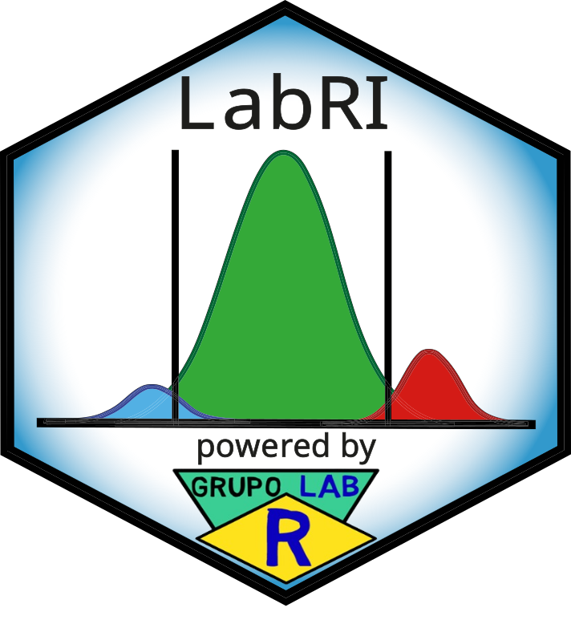
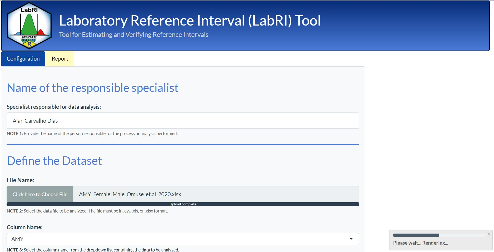

# [𝗟𝗮𝗯𝗥𝗜 𝗦𝗵𝗶𝗻𝘆 𝗖𝗼𝗻𝗻𝗲𝗰𝘁](https://img.shields.io/badge/LabRI%20Shiny%20Connect-%230070C0?style=for-the-badge&logoColor=white)

**LabRI Shiny Connect** is the cloud-ready implementation of the LabRI Shiny Application for the estimation and verification of reference intervals in clinical laboratories. It preserves the full analytical structure of the **LabRI method** while adapting the application to a **session-based, cloud-compatible mode**: no figures, spreadsheets, intermediate files, `.RData`, `.Rhistory`, or HTML reports are written to persistent folders on the server. The application is designed for **Posit Connect**, **Posit Cloud**, and institutional Shiny servers, and a public demonstration instance is currently hosted on Posit Connect Cloud.

**Repository contents:**

- **`app.R`** — Launches the Shiny interface and orchestrates execution of the LabRI method in a cloud-compatible environment.
- **`LabRI_script_connect.Rmd`** — Analytical script that implements the LabRI method and renders the HTML report during the Shiny session.
- **`www/`** — Static files used by the interface (logo, screenshots).

Deployment-specific files such as `manifest.json` or `renv.lock` may also be included depending on the target platform.

---

## 🌐 𝗟𝗶𝘃𝗲 𝗱𝗲𝗺𝗼𝗻𝘀𝘁𝗿𝗮𝘁𝗶𝗼𝗻 𝗼𝗻 𝗣𝗼𝘀𝗶𝘁 𝗖𝗼𝗻𝗻𝗲𝗰𝘁 𝗖𝗹𝗼𝘂𝗱

A public deployment is available on **Posit Connect Cloud** as a demonstration instance, allowing the LabRI method to be evaluated directly in the browser without installing R or RStudio.

### 👇 **Click here to access the LabRI Shiny Connect live demo** 👇

The instance runs on the **Posit Connect Cloud Free plan** (4 GB memory, 1 CPU, 20 monthly active hours, max. 5 hosted apps). Under these constraints the demo may exhibit **instability or memory-related failures** with large datasets or reports containing many figures. It is intended **strictly as a showcase**, not as a production system, and should not be used to process sensitive laboratory data.

### Deploying your own instance

For institutional or production use, users are encouraged to **fork the official repository** — i.e., create a personal GitHub copy that can be freely modified, redeployed, and synchronized with the original:

🔗 **Official repository:** [https://github.com/labrgrupo/LabRI_shiny_connect](https://github.com/labrgrupo/LabRI_shiny_connect)

From a fork, users can:

- Deploy on **Posit Connect Cloud (paid tiers)** with higher memory, CPU, and uptime.
- Deploy on a **self-hosted Posit Connect server** or institutional Shiny Server.
- Adapt `LabRI_script_connect.Rmd` and `app.R` for **shinyapps.io**, **AWS**, **Azure**, **Google Cloud Run**, **Hugging Face Spaces**, or **Docker-based** environments.
- Customize the application for internal authentication, branding, or laboratory-specific workflows under the terms of the GPL-3.0 license.

---

## 𝗖𝗹𝗼𝘂𝗱-𝗰𝗼𝗺𝗽𝗮𝘁𝗶𝗯𝗹𝗲 𝗱𝗲𝘀𝗶𝗴𝗻

The **Shiny application for local execution** automatically creates `3_Outputs/Figures/`, `3_Outputs/Spreadsheets/`, and `4_Report_HTML/` and writes figures, spreadsheets, intermediate files, and reports to disk — appropriate for single-user desktop workflows.

This behavior is unsuitable for cloud hosting, where multiple users share a single application directory. **LabRI_shiny_connect** therefore operates in session-based mode: outputs are rendered inside the Shiny interface or in temporary session files only, and the user may download the final HTML report manually. The analytical method is unchanged; only the output architecture differs.

| Feature | LabRI_script.Rmd | LabRI_shiny_connect.Rmd |
|---|---:|---:|
| Runs on the user's computer | Yes | Optional |
| Requires prior installation of R and RStudio | Yes | No (for end users in a deployed cloud environment) |
| Designed for Posit Connect / Posit Cloud | No | Yes |
| Automatically creates output folders | Yes | No |
| Automatically saves figures | Yes | No |
| Automatically saves spreadsheets | Yes | No |
| Automatically saves HTML reports to fixed folders | Yes | No |
| Saves `.RData` / `.Rhistory` | Possible | No |
| Uses temporary files only for session rendering | No | Yes |
| Displays report in the Shiny interface | Yes | Yes |
| Browser-based use without local execution | No | Yes |

This makes **LabRI_shiny_connect** the preferred implementation for institutional deployment, cloud-based demonstrations, training environments, and multi-user access.

---

## 𝗨𝘀𝗲𝗿 𝗶𝗻𝘁𝗲𝗿𝗳𝗮𝗰𝗲

The initial interface captures the analyst's name in the **Name of the Responsible Specialist** section and accepts `.csv`, `.xls`, or `.xlsx` uploads in the **Define the Dataset** section, where the relevant data column is selected. A status bar tracks processing progress.

---

## 𝗧𝗵𝗲 𝗟𝗮𝗯𝗥𝗜 𝗠𝗲𝘁𝗵𝗼𝗱

The **LabRI Method** is the analytical core of the **LabRI System**, implemented primarily in `LabRI_script_connect.Rmd`. It is organized in two modules:

- **Estimation Module** — adaptive, multi-criteria estimation of reference intervals via data cleaning, transformation, and clustering, using `refineR`, `reflimR`, and the Expectation–Maximization (EM) algorithm (`mclust`, `mixR`).
- **Verification Module** — three-level analysis assessing statistical uncertainty, equivalence, and concordance, ensuring the estimated intervals are reliable for clinical application.

---

## [𝗔. 𝗘𝘀𝘁𝗶𝗺𝗮𝘁𝗶𝗼𝗻 𝗠𝗼𝗱𝘂𝗹𝗲](https://img.shields.io/badge/LabRI%20Shiny%20Connect-%230070C0?style=for-the-badge&logoColor=white)

This module provides an **adaptive, multi-criteria approach for the indirect estimation** of reference intervals, combining parametric and non-parametric percentile approaches according to the number of clusters in the truncated distribution.

### Adaptive behavior

- **Multi-cluster distributions** — The reference limits estimated by `refineR` and `reflimR` are combined through the **Centroid of Winsorized Reference Limits**: the *Two-stage Winsorization* sub-algorithm first estimates robust winsorized limits, then the *Hartigan–Wong Centroid Reference Limits* sub-algorithm computes the centroid (x = lower limit, y = upper limit) for a centralized, stable estimate. When clusters are sufficiently separated, the EM algorithm further refines the result.
- **Single-cluster distributions** — The EM algorithm applies parametric and non-parametric methods to derive the best reference interval estimate.

### Multi-criteria design

Multiple criteria and methods are combined to ensure robust and comprehensive estimation and verification.

---

## [𝗕. 𝗩𝗲𝗿𝗶𝗳𝗶𝗰𝗮𝘁𝗶𝗼𝗻 𝗠𝗼𝗱𝘂𝗹𝗲](https://img.shields.io/badge/LabRI%20Shiny%20Connect-%230070C0?style=for-the-badge&logoColor=white)

Before routine clinical application — and especially when reference intervals are derived from indirect methods — laboratories must verify their reference intervals. The Verification Module performs a **three-level analysis** to assess whether compared reference limits are equivalent:

1. **First Level — Statistical Uncertainty.** Evaluates the magnitude of statistical uncertainty associated with the reference limits. If uncertainty is within acceptable bounds, the analysis proceeds to the second level.
2. **Second Level — Distance Criterion Based on Equivalence Testing.** Compares the LabRI-estimated reference limit with a comparative limit using equivalence testing to assess whether differences are large enough to be considered relevant from a practical or clinical standpoint.
3. **Third Level — Concordance Evaluation.** Triggered when the second level suggests *Possible Equivalence* or *Probable Equivalence*. Incorporates confidence intervals and applies Fleiss' Kappa, Lin's Concordance Correlation Coefficient, and Flagging Rates to support robust verification.

---

## 𝗠𝗲𝗺𝗼𝗿𝘆 𝗮𝗻𝗱 𝗰𝗹𝗼𝘂𝗱 𝗹𝗶𝗺𝗶𝘁𝗮𝘁𝗶𝗼𝗻𝘀

The LabRI workflow is computationally demanding (reference interval estimation, mixture modeling, confidence intervals, plotting, and HTML rendering). In low-memory cloud environments — particularly free-tier services such as the public demo — the **final HTML conversion step** often requires more memory than the statistical calculations themselves. Large datasets or reports with many figures, interactive plots, or large HTML tables may therefore exceed the available memory.

If a memory failure occurs during report generation, options include:

- reducing the maximum subsample size;
- using a smaller dataset for demonstration purposes;
- running the **Shiny application for local execution** for larger analyses;
- forking the repository and redeploying on a Posit Connect environment with more RAM or on another cloud platform.

This typically reflects the memory ceiling of the hosting environment, not a defect in the dataset or in the LabRI method.

---

## 𝗧𝘂𝘁𝗼𝗿𝗶𝗮𝗹

A usage tutorial covering the installation of R and RStudio and the operation of the Shiny tool is available on the **Grupo Lab R website**, which centralizes the documentation and supporting materials for the LabRI System and other tools developed by the group.

### 👇 **Click here to visit the Grupo Lab R website** 👇

---

## [𝗖𝗼𝗻𝘁𝗮𝗰𝘁](https://img.shields.io/badge/LabRI%20Shiny%20Connect-%230070C0?style=for-the-badge&logoColor=white)

**Submit suggestions and bugs at:**  
https://github.com/labrgrupo/LabRI_shiny_connect/issues

**Email:**  
alancdias@hotmail.com · labrgrupo@gmail.com

**Link to the publication:**  

---

## 𝗟𝗶𝗰𝗲𝗻𝘀𝗲

Distributed under the **GPL-3.0** license.

---
